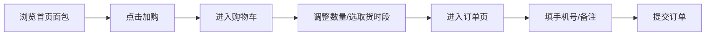

## 1. 产品概述
社区面包店当日预订系统，为周边居民提供当日面包在线预订、次日早晨自提的便捷服务。

- 面向社区居民，简化面包购买流程，提前锁定当日新鲜出炉的面包
- 解决面包店热销品种早售罄、顾客到店白跑的痛点

## 2. 核心功能

### 2.1 功能模块
1. **首页**：当日面包展示网格、加购功能
2. **购物车页**：数量调整、取货时段选择
3. **订单页**：手机号填写、备注、订单提交

### 2.2 页面详情
| 页面名称 | 模块名称 | 功能描述 |
|---------|---------|---------|
| 首页 | 顶部导航 | 品牌标识、购物车入口（带数量徽标） |
| 首页 | 面包卡片网格 | 面包图片、品种名、价格、剩余数量、加购按钮，售罄置灰 |
| 购物车页 | 商品列表 | 已选面包缩略图、名称、单价、数量加减按钮、小计金额 |
| 购物车页 | 取货时段 | 明早 8:00-12:00 每半小时一档选择 |
| 购物车页 | 结算栏 | 商品总金额、去结算按钮 |
| 订单页 | 收货信息 | 手机号输入框、备注文本域 |
| 订单页 | 订单确认 | 商品清单、取货时段、总价、提交订单按钮 |

## 3. 核心流程
用户在首页浏览当日面包，选择品种加入购物车；在购物车页调整数量、选定取货时段；在订单页填写手机号和备注后提交订单。

## 4. 用户界面设计

### 4.1 设计风格
- **主色**：米白背景 `#FAF6F0`，焦糖色强调 `#A0522D`，墨绿点缀 `#2F5D4B`
- **按钮风格**：圆角矩形，焦糖色主按钮，悬停微加深，点击微弹动画
- **字体**：思源宋体（Source Han Serif SC），标题粗体，正文常规
- **布局**：卡片式网格布局，顶部固定导航栏
- **图标**：简约线性风格（lucide-react）

### 4.2 页面设计概览
| 页面名称 | 模块名称 | UI 元素 |
|---------|---------|---------|
| 首页 | 面包卡片 | 圆角卡片、图片圆角、悬停上浮阴影、加购按钮微弹 |
| 购物车页 | 数量控件 | 圆角加减按钮、数字居中、取货时段胶囊选择器 |
| 订单页 | 表单 | 下划线输入框、文本域、大号提交按钮 |

### 4.3 响应式
桌面优先设计，移动端自适应卡片列数（桌面 3-4 列，平板 2 列，手机 1 列）。
