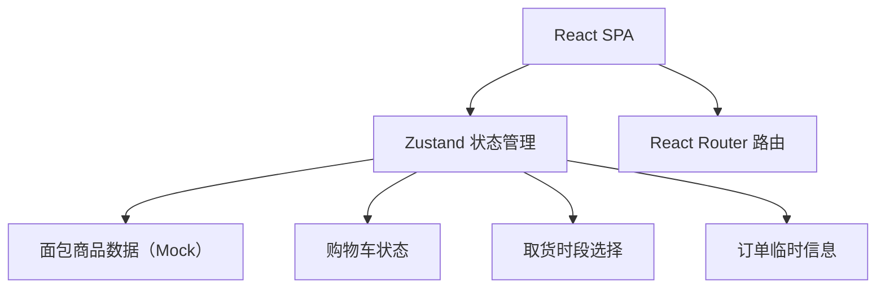

## 1. 架构设计
纯前端单页应用，数据临时存储于内存（Zustand），刷新页面数据丢失。



## 2. 技术说明
- **前端**：React@18 + TypeScript + Vite + Tailwind CSS@3
- **初始化工具**：vite-init
- **路由**：react-router-dom
- **状态管理**：zustand
- **图标**：lucide-react
- **后端**：无（纯前端 Mock 数据）

## 3. 路由定义
| 路由 | 用途 |
|-----|-----|
| / | 首页 - 当日面包展示与加购 |
| /cart | 购物车页 - 数量调整与取货时段选择 |
| /order | 订单页 - 手机号填写与订单提交 |

## 4. 数据模型

### 4.1 面包商品（BreadItem）
```typescript
interface BreadItem {
  id: string;
  name: string;
  price: number;
  stock: number;
  image: string;
  description: string;
}
```

### 4.2 购物车条目（CartItem）
```typescript
interface CartItem {
  breadId: string;
  quantity: number;
}
```

### 4.3 订单信息（OrderInfo）
```typescript
interface OrderInfo {
  phone: string;
  remark: string;
  pickupTime: string;
  items: CartItem[];
  totalAmount: number;
}
```

## 5. 项目目录结构
```
src/
├── components/       # 可复用组件
│   ├── BreadCard.tsx
│   ├── NavBar.tsx
│   ├── QuantityControl.tsx
│   └── TimeSlotPicker.tsx
├── pages/            # 页面组件
│   ├── Home.tsx
│   ├── Cart.tsx
│   └── Order.tsx
├── store/            # zustand 状态
│   └── useBakeryStore.ts
├── data/             # Mock 数据
│   └── breads.ts
├── types/            # 类型定义
│   └── index.ts
├── App.tsx
├── main.tsx
└── index.css         # Tailwind + 全局样式
```
